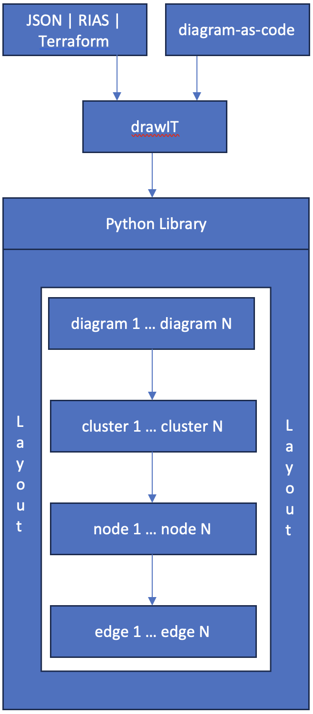

# drawIT
Automate creation and layout of diagrams that can be viewed in diagrams.net.

Input Formats

1. JSON - Input is from tool-generated JSON/YAML for existing infrastructure.
2. RIAS - Input is from RIAS APIs for existing infrastructure.
3. Terraform - Input is from Terraform for existing infrastructure.
4. diagram-as-code: Input is python code.

Logic Flow

Supported Features

| Feature | JSON | RIAS | Terraform |
| --- | --- | --- | --- |
| Cloud | :heavy_check_mark: | :heavy_check_mark: | :heavy_check_mark: |
| Region | :heavy_check_mark: | :heavy_check_mark: | :heavy_check_mark: |
| VPC | :heavy_check_mark: | :heavy_check_mark: | :heavy_check_mark: |
| Availability Zone | :heavy_check_mark: | :heavy_check_mark: | :heavy_check_mark: |
| Subnet | :heavy_check_mark: | :heavy_check_mark: | :heavy_check_mark: |
| VSI | :heavy_check_mark: | :heavy_check_mark: | :heavy_check_mark: |
| Floating IP |:heavy_check_mark: | :heavy_check_mark: | :heavy_check_mark: |
| Public Gateway | :heavy_check_mark: | :heavy_check_mark: | :heavy_check_mark: |
| VPN Gateway | :heavy_check_mark: | :heavy_check_mark: | |
| ALB | :heavy_check_mark: | :heavy_check_mark: | :heavy_check_mark: |
| NLB | :heavy_check_mark: | :heavy_check_mark: | :heavy_check_mark: |
| Network ACLs | 12/15 | | |
| Security Groups | 1/15 | | |
| Direct Link | 2/15 | | |
| Routing Tables | | | |
| Routing Table Routes | | | |
| Bare Metal Servers | | | | 
| Images | | | |
| Volumes | | | |
| VPE Gateways | | | |
| Storage Devices | | | |
| Storage Layers | | | |
| Instance Groups | | | |
| Placement Groups | | | |
| Address Prefixes | | | |
| Distributed NLB | | | |
| Dedicated Hosts | | | |
| Dedicated Host Groups | | | |
| Node Reservations | | | |
| Export Policies | | | |
| Export Policy Rules | | | |
| Flow Log Collectors | | | |
| Snapshots | | | |
| Keys | | | |
| Shares | | | |
| IKS Clusters | | | |
| IKS VPC LB | | | |
| Schematics | | | |

--- 

Installation Guide

drawIT

- Fork or copy drawIT to a local directory.

Python

1. Install Python (3.11.3+):
- Install [Python](https://www.python.org/downloads/).
- After installation the installer will open the install directory.
- Run Update Shell Profile.command to create .zprofile with Python in PATH.
- Add alias python="python3" to .zprofile.
2. Install PIP:
- curl https://bootstrap.pypa.io/get-pip.py -o get-pip.py
- python get-pip.py
3. Install libraries:
- pip install pandas
- pip install pyyaml
- pip install requests
- pip install tabulate

JSON Guide

Refer to run.sh and rungui.sh in the scripts folder.

RIAS Guide

Refer to rungui.sh or runrias.sh in scripts folder.

Terraform Guide

Refer to runtf.sh in the scripts folder.

diagram-as-code Guide

Create or copy example.py to top folder of drawIT and run python example.py.

Structure

Single Diagram

  from drawit import Diagram, Cluster, Node, Edge

    with Diagram("diagram", ...):

      with Cluster("cluster1", ...):
        node1 = Node("node1", ...)

        with Cluster("cluster2", ...) as cluster2:
          node2 = Node("node2", ...)

        # Single arrow line from cluster2 to node1.
        node1 << cluster2

Multiple Diagrams

  from drawit import Diagrams, Diagram, Cluster, Node, Edge

    with Diagrams("diagrams", ...):

      with Diagram("diagram1", ...):

         with Cluster("cluster1", ...):
            node1 = Node("node1", ...)

            with Cluster("cluster2", ...) as cluster2:
              node2 = Node("node2", ...)

            # Single arrow line from cluster2 to node1.
            node1 << cluster2

      with Diagram("diagram2", ...):

         with Cluster("cluster1", ...):
            node1 = Node("node1", ...)

            with Cluster("cluster2", ...) as cluster2:
              node2 = Node("node2", ...)

            # Single arrow line from cluster2 to node1.
            node1 << cluster2

Edges

  from drawit import Diagram, Cluster, Node, Edge

    with Diagram(...):

      with Cluster(...):
        node1 = Node("node1", ...)
        node2 = Node("node2", ...)

        with Cluster(...):
          node3 = Node("node3", ...)
          node4 = Node("node4", ...)

          # No arrow line between node3 and node4.
          node3 - node4
    
          # Left single arrow line from node4 to node3 with/without label.
          node3 << node4
          node3 << Edge(label="arrow") << node4  

          # Right single arrow line from node3 to node4 with/without label.
          node3 >> node4
          node3 >> Edge(label="arrow") >> node4  

          # Double arrow line between node3 and node4.
          node3 << Edge(label="arrow") >> node4  

Parameters

Notes:

- Subject to change until finalized.
- Use shape parameter default as shape names are subject to change.
- Direction default is left-to-right changable to top-to-bottom. 
- Badges are not currently enabled.
- Connectors can be defined between clusters and nodes with or without arrowheads.
- Diagrams can be exported to jpg, pdf, ong, or svg from diagrams.net.
- Planned: Direct export to jpg, pdf, png, or svg.
- Planned: Improve support for long labels and sublabels.
- Planned: Badges.

Diagrams:

- name
- filename

Diagram:

- name
- filename
- direction = LR, TB for all shapes - not currently enabled
- alternate = WHITE, LIGHT, NONE, USER for all clusters
- provider = ANY, IBM for all clusters``
- fontname = IBM Plex Sans fonts - not currently enabled
- fontsize = numeric value, defaults to 14 - not currently enabled
- outformat = JPG, PDF, PNG, SVG, XML - not currently enabled

Cluster:

- label = primary label
- sublabel = secondary text
- icon = name of icon
- shape = COMPONENT, LOCATION, NODE, ZONE
- pencolor = medium and dark line colors from IBM Color Palette
- bgcolor = light fill colors from IBM Color Palette or white or transparent
- direction = LR, TB for nested shapes
- alternate = WHITE, LIGHT, NONE, USER for nested clusters, not currently enabled
- provider = ANY, IBM for nested shapes - not currently enabled
- fontname = IBM Plex Sans fonts
- fontsize = numeric value, defaults to 14
- badgetext = not currently enabled, fontsize is 12
- badgeshape = not currently enabled
- badgepencolor = not currently enabled 
- badgebgcolor = not currently enabled

Node:

- label = primary label
- sublabel = secondary text
- icon = name of icon
- shape = COMPONENT, NODE
- pencolor = medium and dark line colors from IBM Color Palette
- bgcolor = light fill colors from IBM Color Palette or white or transparent
- fontname = IBM Plex Sans fonts
- fontsize = numeric value, defaults to 14
- badgetext = not currently enabled, fontsize is 12
- badgeshape = not currently enabled
- badgepencolor = not currently enabled 
- badgebgcolor = not currently enabled

Edge:

- label = edge label
- style = SOLID, DASHED - not currently enabled
- arrow = arrow properties - not currently enabled
- fontname = IBM Plex Sans fonts
- fontsize = numeric value, defaults to 12

Colors

Notes:

- Line and fill colors are from [IBM Color Palette](https://www.ibm.com/design/language/color/).
- Line colors are derived from the icon name for simplicity so pencolor doesn't have to be manually specified for each icon.
- Line colors can also be manually set which overrides the derived color.
- Line and fill colors can be specified by name, number, hex, or component (recommended).
- Fill colors alternate between white and light starting with white for nested containers for viewability.
- Fill colors can be changed to alternate between light and white starting with light for nested containers.
- Fill colors can also be manually set.

Medium Line (pencolor):

| Name | Number | Hex | Component |
| --- | --- | --- | --- |
| red | red50 | #fa4d56 | security |
| magenta | magenta50 | #ee5396 | devops |
| purple | purple50 | #a56eff | applications |
| blue | blue60 | #0f62fe | data, storage |
| cyan | cyan50 | #1192e8 | network |
| teal | teal50 | #009d9a | management |
| green | green60 | #198038 | compute, services |
| yellow | yellow50 | #b28600 | (limited use) |
| orange | orange50 | #eb6200 | (limited use) |
| coolgray | coolgray50 | #878d96 | backend, industry, location |
| gray | gray50 |  #8d8d8d | (not currently used) |
| warmgray | warmgray50 | #8f8b8b | (not currently used) |
| black | black | #000000 | user |

Dark Line (pencolor):

| Name | Number | Hex | Component |
| --- | --- | --- | --- |
| darkred | red70 | #a2191f |  (not currently used) |
| darkmagenta | magenta70 | #9f1853 | (not currently used) |
| darkpurple | purple70 | #6929c4 | (not currently used) |
| darkblue | blue80 | #002d9c | (not currently used) |
| darkcyan | cyan70 | #00539a | (not currently used) |
| darkteal | teal70 | #005d5d | (not currently used) |
| darkgreen | grean80 | #044317 | (not currently used) |
| darkyellow | yellow70 | #684e00 | (limited use) |
| darkorange | orange70 | #8a3800 | (limited use) |
| darkcoolgray | coolgray70 | #4d5358 | (not currently used) |
| darkgray | gray70 | #525252 | (not currently used) |
| darkwarmgray | warmgray70 | #565151 | (not currently used) |

Light Fill (bgcolor):

| Name | Number | Hex | Component |
| --- | --- | --- | --- |
| lightred | red10 | #fff1f1 | security |
| lightmagenta | magenta10 | #fff0f7 | devops |
| lightpurple | purple10 | #f6f2ff | applications |
| lightblue | blue10 | #edf5ff | data, storage |
| lightcyan | cyan10 | #e5f6ff | network |
| lightteal | teal10 | #d9fbfb | management |
| lightgreen | green10 | #defbe6 | compute, services |
| lightyellow | yellow10 | #fcf4d6 | (limited use) |
| lightorange | orange10 | #fff2e8 | (limited use) |
| lightcoolgray | coolgray10 | #f2f4f8 | backend, industry, location |
| lightgray | gray10 | #f4f4f4 | (not currently used) |
 lightwarmgray | warmgray10 | #f7f3f2 | (not currently used) |
| white | white | #ffffff | (alternating fills) |
| none | none | none | (zone fills) |

Icons

Notes:

- Icons are from [IBM Design Center](https://www.ibm.com/design/language/iconography/ui-icons/library/).
- Icon usage name is used for simplicity and clarity.
- Planned: Support icons not from IBM Design Center.

List of icon usage names (subject to change until finalized, duplicates in list are expected):

[icons.txt](drawit/icons.txt)

Fonts

Notes:

- Fonts are from [IBM Plex](https://www.ibm.com/plex/).
- Supports all currently available Plex fonts.

Font Names:

- IBM Plex Sans
- IBM Plex Sans Arabic
- IBM Plex Sans Devanagari
- IBM Plex Sans Hebrew
- IBM Plex Sans JP
- IBM Plex Sans KR
- IBM Plex Sans Thai

Examples

Secure Landing Zone

[vpc-secure-landing-zone.py](examples/secure-landing-zone/vpc-secure-landing-zone.py)

[mixed-secure-landing-zone.py](examples/secure-landing-zone/mixed-secure-landing-zone.py)

[openshift-secure-landing-zone.py](examples/secure-landing-zone/openshift-secure-landing-zone.py)

VPC Single Region

[vpc-single-region-consumer-internet.py](examples/vpc-single-region/vpc-single-region-consumer-internet.py)

[vpc-single-region-consumer-intranet.py](examples/vpc-single-region/vpc-single-region-consumer-intranet.py)

[vpc-single-region-consumer-private-link.py](examples/vpc-single-region/vpc-single-region-consumer-private-link.py)

---

## References

- [IT Architecture Diagrams](https://github.com/IBM/it-architecture-diagrams)
- [Code Pattern](https://github.com/IBM/codepattern-multitier-vpc)

## License

This application is licensed under the Apache License, Version 2.  Separate third-party code objects invoked by this application are licensed by their respective providers pursuant to their own separate licenses.  Contributions are subject to the [Developer Certificate of Origin, Version 1.1](https://developercertificate.org/) and the [Apache License, Version 2](https://www.apache.org/licenses/LICENSE-2.0.txt).

